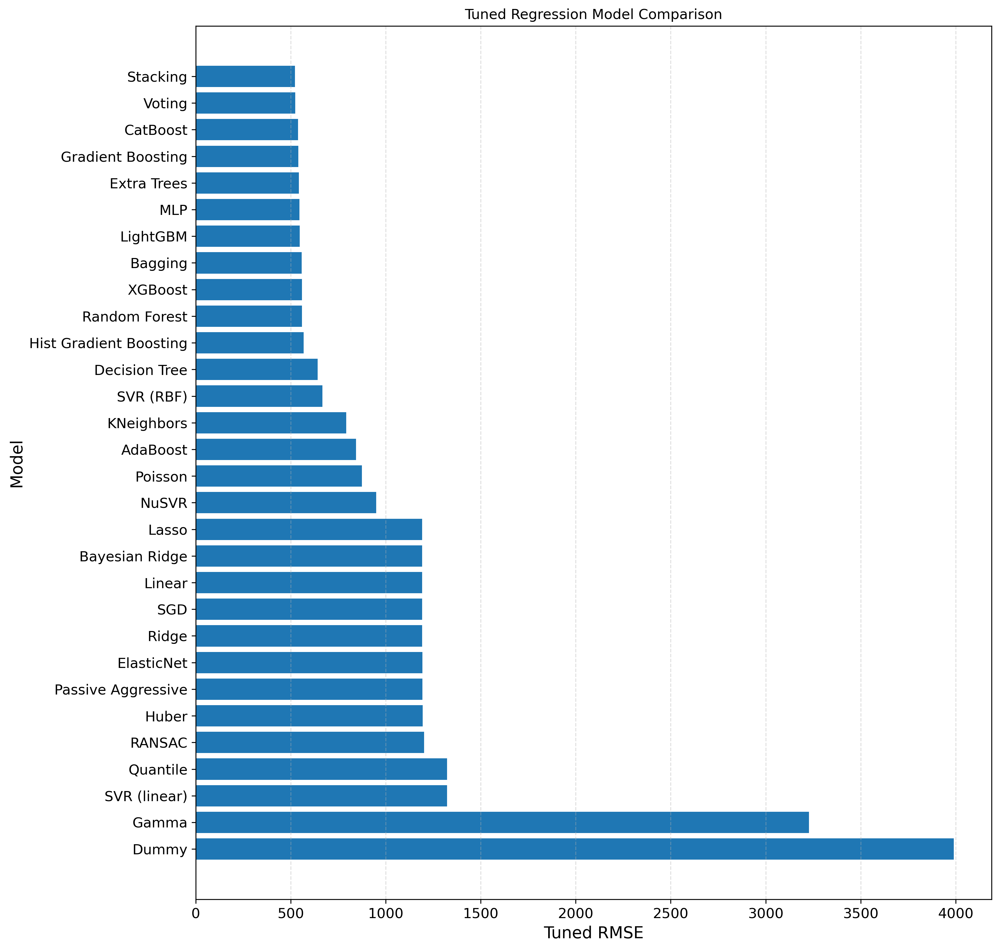
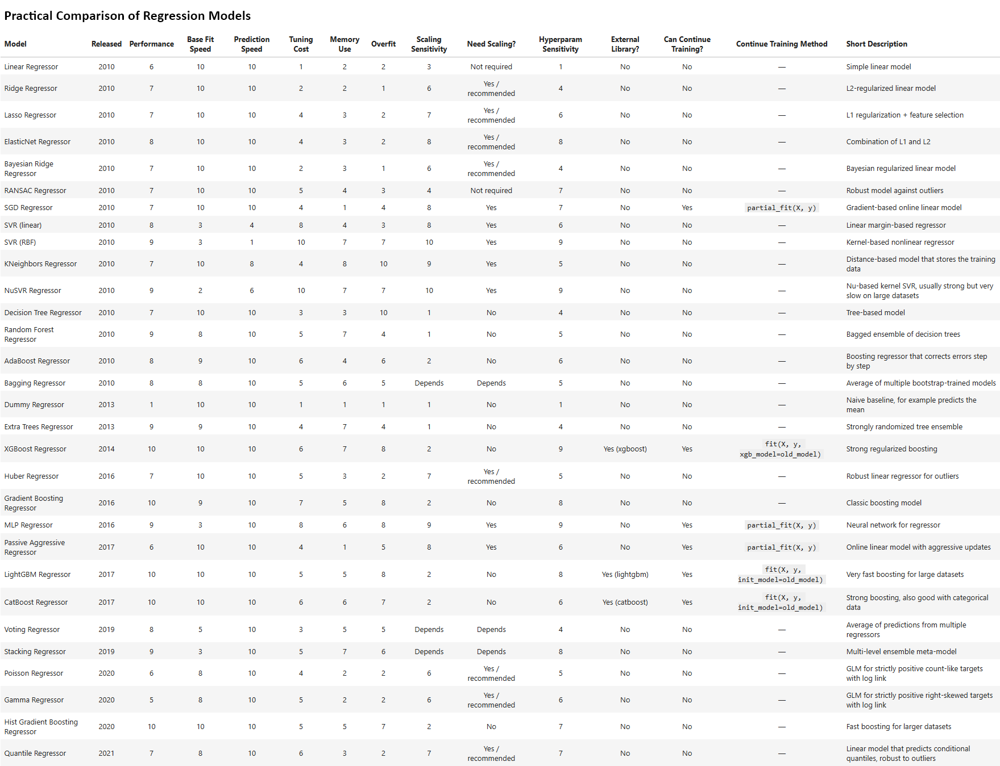
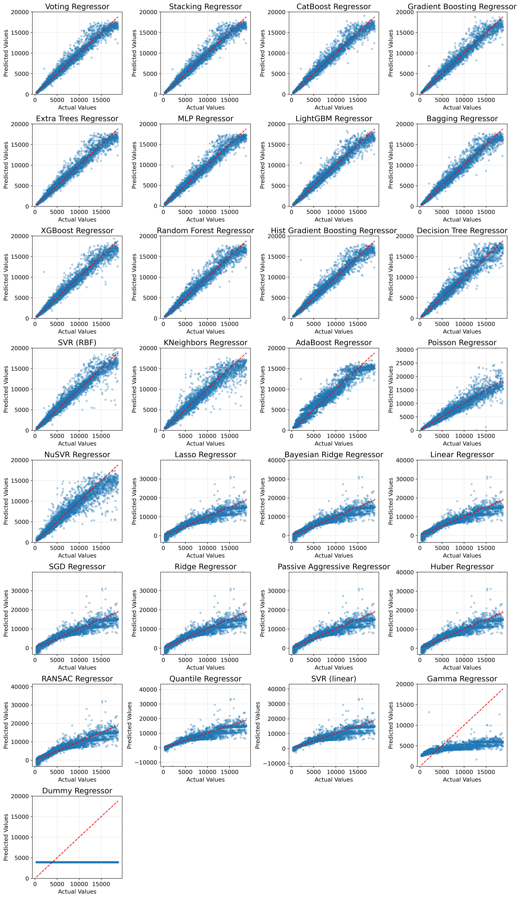
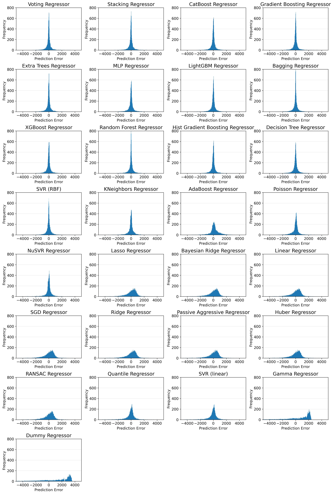
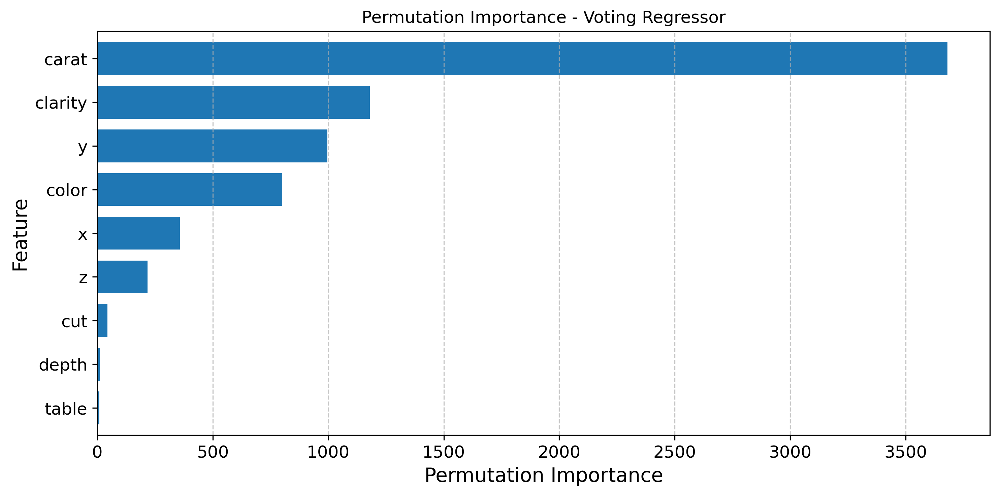

# Supervised Machine Learning Model Comparison

A machine learning portfolio project focused on structured supervised model comparison.

The current public version contains the completed **Regression Model Comparison** project, which compares a wide range of supervised regression models for predicting diamond prices. A **Binary Classification Model Comparison** project is planned as a future extension and will be added after the regression project is fully finalised.

---

## Current Project Status

| Project | Status |
|---|---|
| Regression Model Comparison | Completed |
| Binary Classification Model Comparison | Planned / not included yet |

---

## Project Purpose

The main goal of this repository is not only to find a single best-performing model, but to compare many supervised machine learning algorithms in a consistent, practical, and reproducible way.

The regression project demonstrates:

- End-to-end supervised machine learning workflow
- Data preprocessing with scikit-learn pipelines
- Baseline model training
- Hyperparameter tuning
- Cross-validation
- Final test-set evaluation
- Practical model comparison
- Prediction and residual analysis
- Feature / permutation importance
- Exported HTML report
- Portfolio-ready visual summaries and result tables

---

## Final Regression Result

The best-performing model in the final regression comparison was the **Tuned Stacking Regressor**.

| Model | Test MAE | Test RMSE | Test R² |
|---|---:|---:|---:|
| Tuned Stacking Regressor | 264.66 | 522.41 | 0.9829 |
| Tuned Voting Regressor | 263.88 | 523.72 | 0.9828 |

The **Tuned Stacking Regressor** achieved the best overall RMSE, while the **Tuned Voting Regressor** produced a very similar result and achieved the lowest MAE among the top models.

The full notebook runtime for the final completed run was:

```text
11:42:29
```

From a practical model selection perspective, the best statistical model is not always the only reasonable choice. The project also considers training time, prediction time, saved model size, model complexity, and deployment practicality. In this context, models such as tuned LightGBM and tuned CatBoost can be attractive practical alternatives because they provide strong performance with simpler model artifacts than the largest ensemble combinations.

---

## Repository Structure

```text
supervised-ml-model-comparison/
├── .gitattributes
├── COPYRIGHT.md
├── environment.yml
├── gitignore
├── README.md
├── requirements.txt
│
└── regression/
    ├── README.md
    │
    ├── notebooks/
    │   └── supervised_regression_model_comparison.ipynb
    │
    ├── reports/
    │   └── supervised_regression_model_comparison.html
    │
    ├── images/
    │   ├── supervised_regression_model_comparison.png
    │   ├── supervised_regression_tuned_model_comparison_table.png
    │   ├── supervised_regression_practical_comparison_table.png
    │   ├── supervised_regression_selected_test_sample_predictions.png
    │   ├── supervised_regression_prediction_range_difference_summary.png
    │   ├── supervised_regression_best_model_performance_by_price_range.png
    │   ├── supervised_regression_actual_vs_predicted_best_model.png
    │   ├── supervised_regression_actual_vs_predicted_all_models.png
    │   ├── supervised_regression_actual_vs_predicted_distributions_by_model_group.png
    │   ├── supervised_regression_residuals_best_model.png
    │   ├── supervised_regression_residuals_all_models.png
    │   ├── supervised_regression_error_distribution_best_model.png
    │   ├── supervised_regression_error_distribution_all_models.png
    │   └── supervised_regression_permutation_importance.png
    │
    └── results/
        ├── supervised_regression_tuned_model_comparison_table.csv
        ├── supervised_regression_practical_comparison.csv
        ├── supervised_regression_selected_test_sample_predictions.csv
        ├── supervised_regression_prediction_range_difference_summary.csv
        └── supervised_regression_best_model_performance_by_price_range.csv
```

---

## Regression Model Comparison

The regression project compares a wide range of supervised regression models for predicting diamond prices.

### Target Variable

```text
price
```

### Main Evaluation Metrics

- MAE
- MSE
- RMSE
- R² Score

The primary comparison metric is **RMSE**, while MAE, R², train-test gap, residual behaviour, runtime, model size, and practical usability are also considered.

### Main Notebook

[supervised_regression_model_comparison.ipynb](regression/notebooks/supervised_regression_model_comparison.ipynb)

### HTML Report

[supervised_regression_model_comparison.html](regression/reports/supervised_regression_model_comparison.html)

### Detailed Regression README

[Open the Regression Project README](regression/README.md)

---

## Example Visual Summaries

### Tuned Regression Model Comparison



### Practical Comparison of Regression Models



### Actual vs Predicted Values for All Tuned Regression Models



### Residual Distributions for All Tuned Regression Models



### Permutation Importance for the Best Regression Model



---

## Regression Models Compared

The project compares a broad range of regression model families, including:

- Dummy Regressor
- Linear Regression
- Ridge Regression
- Lasso Regression
- ElasticNet
- Bayesian Ridge
- RANSAC Regressor
- Huber Regressor
- SGD Regressor
- Passive Aggressive Regressor
- Poisson Regressor
- Gamma Regressor
- Quantile Regressor
- Support Vector Regression
- K-Nearest Neighbors Regressor
- Decision Tree Regressor
- Random Forest Regressor
- Extra Trees Regressor
- AdaBoost Regressor
- Gradient Boosting Regressor
- HistGradientBoosting Regressor
- XGBoost Regressor
- LightGBM Regressor
- CatBoost Regressor
- Bagging Regressor
- Voting Regressor
- Stacking Regressor
- MLP Regressor

---

## Machine Learning Workflow

The regression notebook follows this workflow:

1. Load and inspect the dataset
2. Define the target variable
3. Split the data into training and test sets
4. Build preprocessing pipelines
5. Train baseline models
6. Evaluate baseline performance
7. Tune selected models
8. Compare tuned models
9. Evaluate final models on the test set
10. Save selected result tables and visual outputs
11. Analyse prediction behaviour
12. Analyse residuals and residual distributions
13. Review practical strengths and weaknesses of the models
14. Compare runtime, model complexity, and saved fitted model size
15. Interpret permutation importance for the best model

---

## Voting and Stacking Strategy

The project uses a two-stage ensemble strategy for Voting and Stacking.

The initial Voting and Stacking regressors are built from selected untuned model pipelines.

The tuned Voting and Stacking regressors are built from the best estimators found by earlier hyperparameter searches. No additional Voting weight search or Stacking final-estimator grid search is applied in the final version, because these extra searches were computationally expensive and produced only small improvements in previous runs.

This keeps the comparison clear:

- **Initial Voting / Stacking:** built from selected untuned model pipelines
- **Tuned Voting / Stacking:** built from the best estimators found by earlier hyperparameter searches

---

## Practical Model Selection

The project does not select a model based only on the lowest error score.

Although the **Tuned Stacking Regressor** achieved the best RMSE, practical model selection may also depend on:

- training time
- prediction time
- saved fitted model file size
- model complexity
- deployment simplicity
- interpretability
- maintenance cost

This means that a slightly less accurate model may still be a better practical choice in some real-world situations.

For example, tuned LightGBM and tuned CatBoost offer strong predictive performance while remaining simpler than the largest ensemble combinations. The tuned Voting Regressor is also a strong ensemble alternative, but it can create a larger model artifact because it contains multiple component models.

---

## Technologies Used

- Python
- Jupyter Notebook
- pandas
- NumPy
- SciPy
- scikit-learn
- matplotlib
- seaborn
- XGBoost
- LightGBM
- CatBoost
- joblib

---

## How to Run

### Recommended: Conda / Miniforge

The recommended setup is to create the environment from `environment.yml`:

```bash
conda env create -f environment.yml
conda activate supervised-ml-model-comparison
```

Then start Jupyter Notebook:

```bash
jupyter notebook
```

Open:

```text
regression/notebooks/supervised_regression_model_comparison.ipynb
```

Run the notebook from top to bottom.

### Alternative: pip

A `requirements.txt` file is also included as a simpler pip-compatible package list:

```bash
pip install -r requirements.txt
```

The conda environment is recommended because this project uses several machine learning libraries that are often easier to manage through `conda-forge`.

---

## Notes for Reviewers

This repository is designed as a portfolio project.

The notebook shows not only final results, but also the modelling process, tuning logic, practical comparison, prediction analysis, residual analysis, runtime considerations, saved model artifacts, and visual interpretation.

The HTML report is included to make the project easier to review without running the notebook locally.

---

## Planned Extension

A Binary Classification Model Comparison project is planned as a future extension of this repository.

When completed, it will be added under:

```text
binary-classification/
```

---

## Author

**Milan Olah**  
Supervised Machine Learning Model Comparison  
Data Science / Machine Learning Portfolio Project

---

## Copyright

© 2026 Milan Olah. All rights reserved.

This project is shared publicly for portfolio and educational demonstration purposes.  
No permission is granted to copy, redistribute, modify, sell, or present this work as your own without written permission.

For details, see [COPYRIGHT.md](COPYRIGHT.md).
