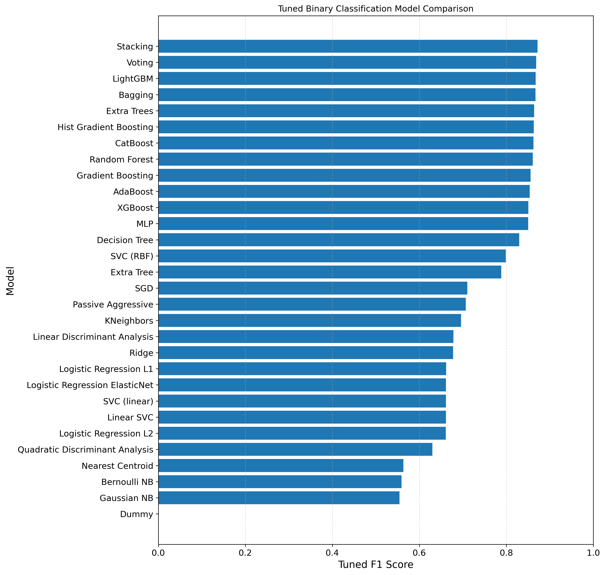

# Supervised Binary Classification Model Comparison

A structured machine learning project comparing multiple supervised binary classification models.

This project is part of the larger repository:

[Supervised ML Model Comparison](../README.md)

---

## Project Objective

The objective of this project is to compare a wide range of supervised classification models using a consistent preprocessing, tuning, evaluation, and reporting workflow.

The project focuses on binary classification and compares models by:

- Classification performance
- Cross-validation behaviour
- Final test-set results
- Confusion matrix analysis
- ROC-AUC performance
- Precision-recall behaviour
- Training and prediction time
- Practical strengths and weaknesses
- Feature importance where appropriate

---

## Dataset

This project uses the diamonds dataset.

The dataset contains physical and categorical information about diamonds, such as size, quality, and dimensions.

Typical features include:

- carat
- cut
- color
- depth
- table
- price
- x
- y
- z

The original clarity feature is transformed into a binary classification target.

---

## Target Variable

The binary classification target is:

```text
is_high_clarity
```

The target indicates whether a diamond belongs to a high-clarity group.

---

## Files

### Notebook

[notebooks/supervised_binary_classification_model_comparison.ipynb](notebooks/supervised_binary_classification_model_comparison.ipynb)

The main Jupyter Notebook containing the full binary classification workflow.

### HTML Report

[reports/supervised_binary_classification_model_comparison.html](reports/supervised_binary_classification_model_comparison.html)

An exported HTML version of the notebook for easier viewing.

### Results

[results/supervised_binary_classification_final_results.csv](results/supervised_binary_classification_final_results.csv)

Final model evaluation table.

[results/supervised_binary_classification_practical_comparison.csv](results/supervised_binary_classification_practical_comparison.csv)

Practical comparison table describing model behaviour and usability.

---

## Evaluation Metrics

The classification models are evaluated using:

| Metric | Meaning |
|---|---|
| Accuracy | Overall proportion of correct predictions |
| Precision | How many predicted positive cases were actually positive |
| Recall | How many actual positive cases were correctly found |
| F1 Score | Balance between precision and recall |
| ROC-AUC | Ability of the model to separate the two classes |
| Confusion Matrix | Breakdown of correct and incorrect predictions |

The main comparison focuses especially on:

- **F1 Score** – because it balances precision and recall
- **ROC-AUC** – because it evaluates class separation ability
- **Confusion Matrix** – because it shows the actual type of classification errors

---

## Models Compared

The project compares a wide range of binary classification model families, including:

### Baseline Model

- Dummy Classifier

### Linear and Regularized Models

- Logistic Regression
- Ridge Classifier
- SGD Classifier
- Passive Aggressive Classifier

### Support Vector Models

- Linear SVC
- SVC with linear kernel
- SVC with RBF kernel

### Distance-Based Models

- K-Nearest Neighbors Classifier
- Nearest Centroid Classifier

### Tree-Based Models

- Decision Tree Classifier
- Random Forest Classifier
- Extra Trees Classifier

### Boosting Models

- AdaBoost Classifier
- Gradient Boosting Classifier
- HistGradientBoosting Classifier
- XGBoost Classifier
- LightGBM Classifier
- CatBoost Classifier

### Ensemble and Neural Models

- Bagging Classifier
- Voting Classifier
- Stacking Classifier
- MLP Classifier

---

## Workflow

The project follows this workflow:

1. Import libraries and configure global settings
2. Load and inspect the dataset
3. Create the binary target variable
4. Define features and target
5. Split the data into training and test sets
6. Build preprocessing pipelines
7. Train baseline classification models
8. Evaluate baseline models
9. Tune selected models with cross-validation
10. Store best estimators
11. Compare tuned model performance
12. Evaluate final models on the test set
13. Save final results
14. Analyse predictions
15. Visualise confusion matrices, ROC curves, and precision-recall curves
16. Interpret feature importance where appropriate

---

## Visual Outputs

### Model Comparison



### Confusion Matrix


### ROC Curve


### Precision-Recall Curve


### Feature Importance


---

## Example Result Summary

TODO: Replace this section with the final model results after the final full run.

| Model | Accuracy | Precision | Recall | F1 | ROC-AUC | Notes |
|---|---:|---:|---:|---:|---:|---|
| TODO | TODO | TODO | TODO | TODO | TODO | Best overall classification model |
| TODO | TODO | TODO | TODO | TODO | TODO | Strong ROC-AUC performance |
| TODO | TODO | TODO | TODO | TODO | TODO | Good practical balance |

---

## Practical Model Comparison

In addition to numerical performance, the project includes a practical comparison of classification models.

The practical comparison considers:

- Speed
- Memory usage
- Overfitting tendency
- Scaling sensitivity
- Hyperparameter sensitivity
- External library requirement
- Ability to continue training
- Interpretability
- Typical use case

This makes the project useful not only for score comparison, but also for understanding when different binary classification models may be appropriate in real-world use.

---

## Key Learning Outcomes

This project demonstrates the ability to:

- Build a complete binary classification workflow
- Create and evaluate a binary target variable
- Use scikit-learn pipelines correctly
- Compare many classification model families
- Apply cross-validation and hyperparameter tuning
- Evaluate models with appropriate classification metrics
- Interpret confusion matrices, ROC-AUC, and precision-recall results
- Save results, reports, and visual outputs
- Present a machine learning project clearly for portfolio purposes

---

## Technologies Used

- Python
- Jupyter Notebook
- pandas
- NumPy
- scikit-learn
- matplotlib
- seaborn
- XGBoost
- LightGBM
- CatBoost
- joblib

---

## How to Run

From the root of the repository:

```bash
pip install -r requirements.txt
jupyter notebook
```

Then open:

```text
binary-classification/notebooks/supervised_binary_classification_model_comparison.ipynb
```

Run the notebook from top to bottom.

---

## Notes

Large exported models, temporary files, local cache files, and environment-specific files should not be included in the public repository.

The public version is intended to show the modelling process, results, and practical comparison clearly without unnecessary local files.

---

## Author

**Milan Olah**  
Data Science / Machine Learning Portfolio Project

---

## Copyright

© 2026 Milan Olah. All rights reserved.

This project is shared publicly for portfolio and educational demonstration purposes.  
No permission is granted to copy, redistribute, modify, sell, or present this work as your own without written permission.

For details, see [../COPYRIGHT.md](../COPYRIGHT.md).
